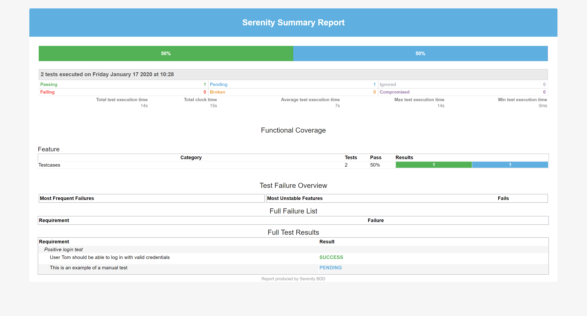

# Serenity BDD Workshop

This is a simple Serenity BDD example project with two tests, prepared
for an internal workshop in our Westernacher QA Team.

## Precondition

In order to run this test on your machine please install the following software:
- [OpenJDK11](https://jdk.java.net/11/) (should also work with java8)
- [gradle 5.1.1](https://gradle.org/install/) or higher

## Configuration 

There are no special configuration needed. Just make sure all dependencies have been downloaded.

## System properties

No system properties implemented so far.

## How to run the test

Command to run test on Windows in a shell console:

`gradle clean test -info reports` 

The argument `reports` will have gradle generate the emailable test summary.
 

## Reports

Once the test has run successfully, locate and open the following files with an internet browser:

### Serenity BDD Test Report (complete version)

`target/site/serenity/index.html`

### Serenity BDD Test Summary (emailable version)

`target/site/serenity/serenity-summary.html`

The reports should look like these:

